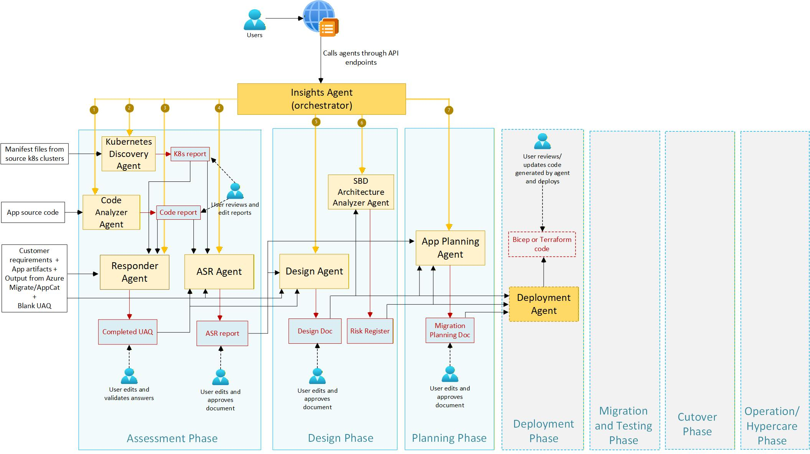

# 🚀 Insights Agent

This folder contains the pro-code implementation of the Insights Agent using Microsoft Foundry.

## Quick Links

| Document | Purpose |
|----------|---------|
| [**QUICKSTART.md**](./docs/QUICKSTART.md) | 🚀 **Start here** — local setup + first run |
| [ARCHITECTURE.md](./docs/ARCHITECTURE.md) | System architecture, key components, design decisions |
| [DEPLOYMENT.md](./docs/DEPLOYMENT.md) | Deployment overview, CI/CD pointers |
| [ENVIRONMENTS.md](./docs/ENVIRONMENTS.md) | Environment variables, local/test setup, secrets/variables |
| [API.md](./docs/API.md) | API surface, integration guidance |
| [AUTHENTICATION.md](./docs/AUTHENTICATION.md) | Authentication model + configuration |
| [RBAC.md](./docs/RBAC.md) | Authorization/RBAC patterns |
| [APP-DATA.md](./docs/APP-DATA.md) | Storage layout, data model notes |
| [LOGGING.md](./docs/LOGGING.md) | Logging conventions and tracing |
| [TROUBLESHOOTING.md](./docs/TROUBLESHOOTING.md) | Common failures and fixes |
| [INTEGRATION.md](./docs/INTEGRATION.md) | Integrations (Search, Storage, MCP, etc.) |
| [TESTING.md](./tests/README.md) | Automated testing guide (strategy, running tests, CI/CD, evaluation) |

### Reference

These are deeper-dive documents that are referenced throughout the primary documents listed in the **Quick Links** table above.

| Document | Reference |
|----------|-------|
| [DEPLOY_INSIGHTS_API.md](./docs/DEPLOY_INSIGHTS_API.md) | How to deploy the Insights API (GitHub Actions, scripts, manual Docker) |
| [INFRA_STANDARD.md](./docs/INFRA_STANDARD.md) | Standard AI Foundry infrastructure setup (dev/POC) via Bicep/Terraform |
| [OPERATION_TRACKING.md](./docs/OPERATION_TRACKING.md) | Operation status tracking system in the Insights API (endpoints, storage, RBAC) |
| [THREAD_MANAGEMENT_IMPLEMENTATION.md](./docs/THREAD_MANAGEMENT_IMPLEMENTATION.md) | Deterministic thread tracking + cleanup for Azure AI Agents (architecture analyzer) |

## Table of Contents

- [Quick Links](#quick-links)
- [High-level Architecture](#high-level-architecture)
- [Key Capabilities](#key-capabilities)
- [Agent Capabilities](#agent-capabilities)
- [Technology Stack](#technology-stack)
- [Repo Folder structure](#repo-folder-structure)
- [Key Benefits of this folder structure](#key-benefits-of-this-folder-structure)

## High-level Architecture

```
                                       ┌─────────────────────────────┐
                                       │      INSIGHTS AGENT         │
                                       │       (Orchestrator)        │
                                       └──────────────┬──────────────┘
                                                      │
          ┌──────────────┬──────────────┬─────────────┼─────────────┬──────────────┬──────────────┐
          ▼              ▼              ▼             ▼             ▼              ▼              ▼
    ┌──────────┐  ┌──────────┐  ┌──────────┐  ┌──────────┐  ┌────────────┐  ┌────────────┐  ┌──────────┐
    │   Code   │  │   k8s    │  │Responder │  │   ASR    │  │   Design   │  │Architecture|  │ Planning │
    │ Analyzer │  │Discovery │  │  Agent   │  │  Agent   │  │   Agent    │  │  Analyzer  |  │  Agent   │  
    │  Agent   │  │  Agent   │  │          │  │          │  │            │  │   Agent    │  │          │
    └──────────┘  └──────────┘  └──────────┘  └──────────┘  └────────────┘  └────────────┘  └──────────┘
          │              │              │            │             │              │              │
          └──────────────┴──────────────┴────────────┴─────────────┴──────────────┴──────────────┘
                                                     ▼
                                ┌────────────────────────────────────────────┐
                                │              AZURE SERVICES                │
                                ├────────────┬────────────┬──────────────────┤
                                │ AI Foundry │  Storage   │    AI Search     │
                                │            │  (Tables,  │   (Document      │
                                │            │   Blobs)   │    Indexing)     │
                                └────────────┴────────────┴──────────────────┘
```

---

## Key Capabilities

- ✅ **Parallel Application Intake** — Process hundreds of apps simultaneously
- ✅ **Intelligent Questionnaires** — Skip questions already answered in provided docs
- ✅ **Automated Assessment Reports** — Generate comprehensive migration assessments
- ✅ **Architecture Generation** — AI-designed Azure architectures with diagrams
- ✅ **Security Risk Analysis** — Technical risk registers and security reviews
- ✅ **App Planning** — Optimized migration schedule based on dependencies
- ✅ **Cost Estimation** — Azure pricing integration for target architecture


## Agent Capabilities

| Agent | Description |
|-------|-------------|
| **Code Analyzer** | Analyzes application source code to identify dependencies, frameworks, and potential migration blockers. Generates a comprehensive code assessment report. |
| **Kubernetes Discovery** | Parses Kubernetes manifest files (Deployments, Services, ConfigMaps, etc.) to understand the current container orchestration setup and recommend AKS migration strategies. |
| **Responder** | Processes intake questionnaires by extracting answers from uploaded documents and storing structured responses in Azure Table Storage for downstream analysis. |
| **ASR (Assessment)** | Synthesizes all collected data (code analysis, K8s discovery, questionnaire responses) into a comprehensive migration assessment report with recommendations. |
| **Design** | Generates target Azure architecture designs including compute, networking, storage, and security components with architecture diagrams. |
| **Architecture Analyzer** | Performs security reviews of proposed architectures, identifies risks, and generates a technical risk register with mitigation recommendations. |
| **Planning** | Creates detailed migration plans with timelines, dependencies, resource requirements, and phased execution strategies. |


The diagram below shows the Insights Agent coordinating the activities of these different sub-agents through the Assessment, Design and Planning phases of a migration program. It outlines the order in which these sub-agents are called and highlights their inputs and outputs.




## Technology Stack

| Layer | Technologies |
|-------|-------------|
| **AI Platform** | Azure AI Foundry, Azure OpenAI, Semantic Kernel |
| **Search & Indexing** | Azure AI Search |
| **Storage** | Azure Blob Storage, Azure Table Storage |
| **Compute** | Azure Container Apps |
| **Integration** | MCP (Model Context Protocol), FastAPI |
| **DevOps** | GitHub Actions, Docker |


## Repo Folder structure

The **foundry-agents** folder contains the Insights Agent API plus supporting services (Indexer and Azure Pricing MCP server), along with deployment scripts, tests, and documentation.

```
foundry-agents/
├── README.md                      # This overview + docs hub
├── requirements.txt               # Python dependencies (API + supporting services)
├── Dockerfile                     # Container build for the main API service
├── .dockerignore                  # Docker build exclusions
├── env.example                    # Example local environment variables
├── env.test.example               # Example test environment variables
├── pytest.ini                     # Pytest configuration
│
├── agents/                        # Insights Agent API + sub-agents (FastAPI)
│   ├── api_main.py                # FastAPI entrypoint
│   ├── orchestrator_agent.py      # Orchestrates sub-agents
│   ├── operation_service.py       # Operation lifecycle + orchestration helpers
│   ├── operation_tracker.py       # Operation tracking implementation
│   ├── models.py                  # Shared data models
│   ├── operation_models.py        # Operation-related models
│   ├── logging_config.py          # Logging configuration
│   ├── tracing_config.py          # Tracing/telemetry configuration
│   ├── mcp_tools.py               # MCP integrations
│   ├── *_agent.py                 # Individual sub-agents (e.g., asr/design/responder)
│   ├── agent-instructions/        # System prompts and prompt JSON
│   ├── architecture_analyzer_agent/
│   ├── code_analyzer/             # Code analyzer implementation
│   ├── utils/                     # Shared utilities
│   └── README.md
│
├── indexer/                       # Indexer service
│   ├── indexer_api.py
│   ├── indexer.py
│   ├── logging_config.py          # Logging configuration
│   ├── tracing_config.py          # Tracing/telemetry configuration
│   ├── requirements.txt           # Indexer-specific dependencies
│   ├── Dockerfile                 # Container build for the indexer
│   └── README.md
│
├── azure-pricing-mcp-server/      # Azure Pricing MCP Server
│   ├── azure_pricing_mcp_server.py # Service entrypoint
│   ├── startup.py                 # Startup hooks/wiring
│   ├── config.py                  # Service configuration
│   ├── logging_config.py          # Logging configuration
│   ├── requirements.txt           # Pricing server dependencies
│   ├── Dockerfile                 # Container build for the pricing server
│   ├── deploy-to-aca.md           # Deploy notes for Azure Container Apps
│   └── README.md
│
├── scripts/                       # Deployment + environment setup scripts
│   ├── deployment/
│   │   ├── deploy_insights_api.(ps1|sh)       # Deploy Insights API
│   │   ├── deploy_indexer.(ps1|sh)            # Deploy Indexer service
│   │   └── deploy_azure_pricing_mcp.(ps1|sh)  # Deploy Pricing MCP server
│   ├── environment-setup/
│   │   ├── README.md                          # Environment setup guide
│   │   ├── import_migration_agent_tables.py   # Import seed data into Table Storage
│   │   ├── export_migration_agent_tables.py   # Export Table Storage data
│   │   ├── setup_virtual_directories.py       # Storage virtual directory helpers
│   │   ├── copy_github_env_vars.py            # Sync env vars into GitHub workflows
│   │   └── template_tables/
│   └── kubernetes/
│
├── tests/                         # Unit/integration/e2e/evaluation tests
│   ├── README.md                  # Test guide
│   ├── conftest.py                # Shared pytest fixtures
│   ├── verify_test_environment.py # Preflight checks for local test runs
│   ├── test-requirements.txt      # Test-only dependencies
│   ├── unit/                      # Unit tests
│   ├── integration/               # Integration tests
│   ├── e2e/                       # End-to-end tests
│   └── evaluation/                # Evaluation harness/tests
│
└── docs/                          # Documentation + diagrams
      ├── QUICKSTART.md              # Getting started (local/dev flow)
      ├── DEPLOYMENT.md              # Deployment overview + pointers
      ├── ARCHITECTURE.md            # System architecture overview
      ├── ENVIRONMENTS.md            # Environment configuration (local/test/prod)
      ├── API.md                     # API surface overview and conventions
      ├── AUTHENTICATION.md          # Auth patterns + configuration
      ├── RBAC.md                    # Authorization/RBAC approach
      ├── APP-DATA.md                # Storage/data model notes
      ├── LOGGING.md                 # Logging conventions
      ├── TROUBLESHOOTING.md         # Common issues and fixes
      ├── INTEGRATION.md             # Integrations (MCP, Search, Storage)
      ├── DEPLOY_INSIGHTS_API.md     # Deep-dive: Insights API deploy
      ├── INFRA_STANDARD.md          # Infra standards and conventions
      ├── OPERATION_TRACKING.md      # Deep-dive: operation tracking
      ├── THREAD_MANAGEMENT_IMPLEMENTATION.md # Deep-dive: threads
      └── media/                     # Diagrams/images

```
## Key Benefits of this folder structure

1. Clean Architecture Principles
      - **Separation of Concerns**: API, business logic, data access clearly separated
      - **Dependency Inversion**: Core business logic doesn't depend on external frameworks
      - **Single Responsibility**: Each folder has a clear, single purpose

2. Scalability
      - **Agent Organization**: Sub-agents are implemented as modules under `agents/`
      - **Supporting Services**: Indexer and pricing MCP server live in dedicated folders
      - **Modular Design**: Easy to add new agents or services

3. Maintainability
      - **Clear Structure**: Developers can quickly find what they need
      - **Consistent Patterns**: Similar organization across different domains
      - **Testability**: Dedicated test structure with proper separation

4. Operational Excellence
      - **Script Organization**: Deployment, testing, and monitoring scripts properly categorized
      - **Configuration Management**: Environment-specific configs separated
      - **Documentation**: Clear documentation structure


**© 2025 AI Migrate Program** — Powered by Microsoft Azure AI