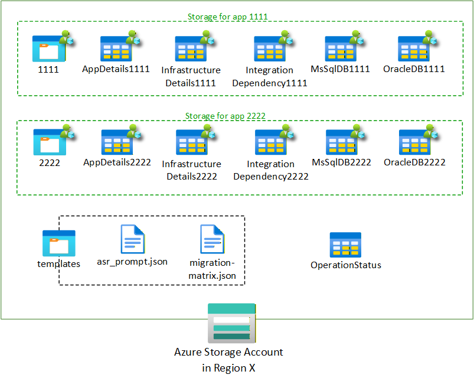

<!--
DOC_INTENT:
	surface: foundry
	page: APP-DATA
	purpose: Describe what data the Foundry agents store, where it is stored, and how data lifecycle/retention should be handled.
	audience: Developers, operators, compliance
	should_cover:
		- Storage components used (Blob/Table/Cosmos) and what each holds
		- Data classification considerations
		- Retention/cleanup guidance (if any)
		- Backup/restore considerations (high level)
	should_not_cover:
		- Customer data examples
	source_refs:
		- cockpit-docs/docs/app-data.md (reference style only)
-->

# App Data

> **Last validated**: 2026-01-29

This page describes the data stores used by the Foundry agents runtime, what is stored in each, and how application data is segmented and secured.

The solution uses the data stores described below.

## Principles

- **Per-application segregation**: application artifacts and structured outputs are isolated per `app_id`.
- **Regional storage**: storage resources should be deployed in the same region as the application’s data residency requirements.
- **Least privilege**: access is granted via Azure RBAC scoped to the smallest practical surface (container/table where possible).

## Azure Storage Account (regional)

The primary data plane for app artifacts and structured assessment outputs is an Azure Storage Account.

A Storage Account is created in each region where the applications being assessed are used. This ensures data for each application stays in its respective region to meet customer data residency compliance requirements.

## Azure Blob Storage

### Per-application container

The data for each application is stored in its own container named after the application ID. This ensures that RBAC permissions can be set on these containers to restrict who among the stakeholders can view or update each application data.

This allows the solution to meet customer data privacy requirements that require full application data segregation across app teams.

This container is used to store:

- Raw artifacts uploaded for the application (documents, architecture diagrams, exports)
- Generated outputs (reports, analysis outputs, exported table data)

The application container is created through the web portal as part of the application onboarding experience.

### Templates container

A separate `templates` container is used to store information needed to configure the agents, such as:

- Prompts used by agents
- Additional grounding knowledge associated with prompts

Examples referenced in the design include `asr_prompt.json` and `migration-matrix.json`.

## Azure Table Storage

In the same Azure Storage Account where the Blob containers are stored for each application, tables are set up for each application to track UAQ responses and store other information collected during the assessment process.

### Unified Assessment Questionnaire (UAQ) tables

Design intent: UAQ tables are created from templates, then cloned per application so each app has its own set of tables.

Tables described in the design document:

- **AppDetails** table: groups the questions from the UAQ in the following categories:
	- Application General Information
	- Application Environment Information
	- Front Tier Details
	- DB Tier Details
	- Design & Operations
	- Privacy, Security and Customer Impact
- **MsSqlDB** table: groups the questions about the MS SQL database. These questions are asked about each one of the SQL servers used by the application.
- **OracleDB** table: groups the questions about the Oracle database. These questions are asked about each one of the Oracle servers used by the application.
- **K8S** table: groups the questions about the Kubernetes cluster to migrate.

Common fields described in the design document:

- **Category**: only used in the AppDetails table with the categories listed above
- **Question**: the question text
- **Guidance**: instructions for answering
- **Response**: the generated answer (or human-entered answer)
- **Citation**: the source of the answer, which could be either the name of a document if the agent automatically found the answer in that document or it could be the email of the person who entered the answer manually during review.
- **Confidence**: the confidence level for the answer as calculated by the agent between 0 (lowest) and 1 (highest). This confidence level is set low for incomplete answers or conflicting answers. If no information is found, the agent responds with low confidence (0.0-0.3) and explains what's missing.
- **Timestamp**: the date and time this row was last updated

Note: exact table schemas are implementation-defined; treat the list above as design intent.

### Derived tables

In addition to UAQ tables, the following two tables are also maintained by the Responder agent in this Storage Account (as described in the design document):

- **InfrastructureDetails**: extracted server / infrastructure inventory
- **IntegrationDependency**: extracted dependency mapping (network/system dependencies)

These two tables also contain the Timestamp, Confidence and Citation fields.

The following diagram illustrates the containers and tables created for two applications with the IDs 11111 and 22222:

### Operation tracking tables

The runtime tracks long-running operations (async analysis, report generation, etc.) in the **OperationStatus** table.

For details, see [OPERATION_TRACKING.md](./OPERATION_TRACKING.md).

## Azure RBAC and access model

The access model is based on Azure RBAC with Microsoft Entra ID identities.

Design intent:

- **Blob access**: scoped to the application’s container when possible.
- **Table access**: scoped to the application’s tables when possible.

Common roles referenced:

- **Storage Blob Data Contributor**: allows users to upload files related to the application in the per-application blob container
- **Storage Table Data Contributor**: allows users to read and update UAQ responses (AppDetails, MsSqlDB, OracleDB) and agent-produced data (InfrastructureDetails, IntegrationDependency)

Because RBAC assignments can take time to propagate, expect a short delay after provisioning before access checks succeed.

## Provisioning model (design intent)

The design document assumes:

- The application container is created through the web portal during the application onboarding experience.
- The application tables are created through the plugin `clone_all_templates` (described in [ARCHITECTURE.md](./ARCHITECTURE.md)).
- The RBAC roles mentioned previously are set on the application container and tables during their creation.
- Relevant data about the corresponding application (such as its name and owners) are stored in the container and tables metadata.

## Why Azure Storage (design intent)

The design chooses Azure Storage over other database technologies for:

- **Security**: permissions via Microsoft Entra ID users and groups at the table or container level, meeting customer app data segregation requirements.
- **Compliance**: deploy one Storage Account per region to meet customer regional data privacy requirements.
- **Simplicity**: fit for key-value style data and basic queries, with limited scalability and latency requirements.
- **Cost**: cost-effective compared to other options.
- **Operability**: minimum overhead to deploy and maintain.
- **Adoption**: many customers already vet/approve Storage Accounts.

If more elaborate requirements arise (for example a shared database for the PlanOps Agent), the design notes using the second Cosmos DB deployed as part of the AI Landing Zone reference architecture: https://aka.ms/ailz

## Azure Cosmos DB (BYO thread storage)

Azure AI Foundry leverages Cosmos DB to persist and manage conversation history between users and agents. This is referred to as bring-your-own (BYO) thread storage.

This allows developers to store:

- User messages
- System messages
- Agent inputs and outputs

Design intent:

- Database: `enterprise_memory`
- Containers:
	- `thread-message-store`: end-user conversation messages
	- `system-thread-message-store`: internal system messages
	- `agent-entity-store`: model inputs and outputs

This setup ensures agents maintain contextual awareness across sessions and enables secure, enterprise-grade data control.

Cosmos DB supports logical separation of user data to ensure privacy and compliance:

- Each thread is scoped to a specific user or session.
- Users cannot access threads or messages from other users.
- This is enforced through application logic and Cosmos DB partitioning strategies.

Future enhancements described in the design document include:

- Using Cosmos DB to store additional observability information over time:
	- Evaluation metrics (for example groundedness and relevance)
	- Agent decision logs
	- Tool usage history
- Using Cosmos DB to store shared portfolio information for the Migration and Modernization program that other agents interact with (for example PlanOps wave planning and migration status reporting)

