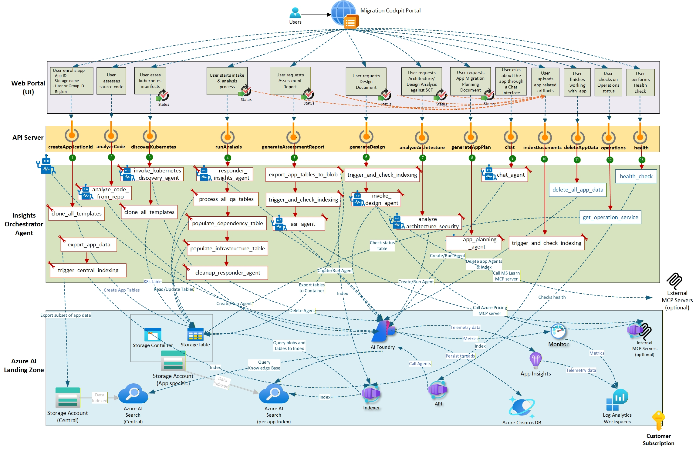

<!--
DOC_INTENT:
	surface: foundry
	page: ARCHITECTURE
	purpose: Explain the high-level system architecture of the Foundry agents (components, data flows, and key dependencies).
	audience: Developers, architects
	should_cover:
		- Major components (orchestrator, agents, tools/MCP, storage/search)
		- Request/response flows and background processing
		- Where state lives (threads/files/vector indexes)
		- Deployment shapes (local vs hosted)
	should_not_cover:
		- Step-by-step deployment instructions (belongs in DEPLOYMENT)
	source_refs:
		- cockpit-docs/docs/architecture.md (reference style only)
-->

# Architecture (AI Foundry)

> **Last validated**: 2026-01-29

This section describes the Architecture of the AI Insights agents.

For endpoint contracts and the full API surface, see [API.md](./API.md).

## Diagrams

### Agent view


### Endpoint + orchestration view



## Agents

As described in the solution overview, there is one agent called the **Insights Agent** that acts as the orchestrator, coordinating multiple sub-agents:

- Code Analyzer Agent
- Kubernetes Discovery Agent
- Responder Agent
- ASR Agent
- SBD Architecture Analyzer Agent
- Design Agent
- App Migration Planning Agent *(design/roadmap; not currently exposed as an API endpoint in this repo)*
- Chat Agent *(design/roadmap; not currently exposed as an API endpoint in this repo)*

These agents have been implemented on Azure AI Foundry using the Python Azure AI Foundry and Semantic Kernel SDKs.

We will be upgrading them soon to the new Agent Framework SDK.

The diagrams above depict these agents along the API endpoints used to call them, the Semantic Kernel plugins (red rectangles) and other functions (blue rectangle) used by the agents to carry out their tasks.

## Insights Orchestrator Agent

The **Insights Orchestrator Agent** coordinates the first three phases of a migration program:

1. Assessment (including discovery)
2. Design
3. Planning

One orchestrator agent is created (or reused) **per application** to keep app data segregated.

In code, orchestration and plugin functions are implemented in [orchestrator_agent.py](../agents/orchestrator_agent.py) and invoked by the FastAPI service in [api_main.py](../agents/api_main.py).

### Plugins and functions used by the orchestrator

This list is formatted from the design document. Where the design document differs from this repo’s implementation (for example endpoint spelling), the trigger names are normalized to match the code, and any not-yet-implemented capabilities are explicitly marked as *(design/roadmap)*.

1. **`clone_all_templates`**
	 - Trigger: `POST /createApplicationId`
	 - Purpose:
		 - Validates the per-app blob container in Azure Storage (expects it to already exist).
		 - Checks that the user invoking the endpoint has “Storage Blob Data Contributor/Owner” permission.
		 - Creates the tables for the application in the same Azure Storage Account based on existing templates stored in that Storage Account.
		 - These tables contain the Unified Assessment Questionnaire (UAQ) as well as other information generated during assessment.
		 - The application ID is added as a suffix to the name of the tables created for the application.
		 - Sets RBAC permissions (for example “Storage Table Data Contributor”) on the tables created for the application to restrict access.
		 - Stores information about the application (such as its name and owners) in the tables metadata.

2. **`analyze_code_from_repo`**
	 - Trigger: `POST /analyzeCode` (async)
	 - Purpose: creates and runs the Code Analyzer Agent to assess application code or Terraform.
	 - Design intent: this endpoint is only invoked when an application needs to be refactored and its code needs to be analyzed.

3. **`invoke_kubernetes_discovery_agent`**
	 - Trigger: `POST /discoverKubernetes` (async)
	 - Purpose: creates and runs the Kubernetes Discovery Agent for workloads destined for AKS.
	 - Design intent: this endpoint is only invoked when an application running on a 3rd party Kubernetes cluster needs to be migrated to AKS.

4. **`responder_insights_agent`**
	 - Trigger: `POST /runAnalysis` (async)
	 - Purpose: creates and runs the Responder Agent, then invokes supporting plugins:
		 - **`process_all_qa_tables`**: answers in bulk as many questions as possible in the AppDetails table setup for the application by `clone_all_templates`. The agent grounds on information uploaded for the application in the Storage Account and indexed in Azure AI Search. Questions not answered automatically (or answers flagged as low confidence) are then processed one at a time.
		 - **`populate_dependency_table`**: generates the content of the network dependencies table from the information found in the app Knowledge Base (KB).
		 - **`populate_infrastructure_table`**: populates the server infrastructure details table based on the information found in the app KB.
		 - **`cleanup_responder_agent`**: deletes the Responder agent and its shared thread for the app.

5. **`export_app_tables_to_blob`**
	 - Trigger: `POST /generateAssessmentReport` (async)
	 - Purpose:
		 - Exports all the data generated in the storage tables by the Responder Agent into a JSONL file so that it can be indexed by `trigger_and_check_indexing`.
		 - Once the index has been updated with the table data, invokes **`asr_agent`** to create and run the ASR Agent.
		 - This ensures all answers collected by the Responder Agent are available to the ASR Agent.

6. **`trigger_and_check_indexing`** (pre-design)
	 - Trigger: used as a prerequisite step before `POST /generateDesign` (async)
	 - Purpose:
		 - Indexes the generated ASR report and then creates and runs the Design Agent.
		 - The Design Agent consumes the ASR report along with other artifacts from the knowledge base and then generates the Design document.

7. **`analyze_architecture_security`**
	 - Trigger: `POST /analyzeArchitecture` (async)
	 - Purpose: runs the SBD Architecture Analyzer Agent which produces a Risk Register document.
	 - Note: the design document refers to `analyseArchitecture`; the implementation in this repo is `POST /analyzeArchitecture`.

8. **App Migration Planning agent plugin** *(design/roadmap)*
	 - Design intent: `app_planning_agent` is called by the orchestrator when the API endpoint `generateAppPlan` is invoked to create and run the App Migration Planning Agent which produces a Migration Plan document.
	 - Current state: there is no `POST /generateAppPlan` endpoint implemented in [api_main.py](../agents/api_main.py).

9. **Chat agent plugin** *(design/roadmap)*
	 - Design intent: `chat_agent` is called by the orchestrator when the API endpoint `chat` is invoked to have an interactive chat conversation with the Chat Agent about the application.
	 - Current state: there is no `POST /chat` endpoint implemented in [api_main.py](../agents/api_main.py).

10. **`trigger_and_check_indexing`** (app index; API-callable)
	 - Trigger: `POST /indexDocuments`
	 - Purpose:
		 - Creates the per-app Azure AI Search index if it does not already exist.
		 - Indexes artifacts uploaded to the application blob container, including documents (text, PDF, Word, XLSX, PPT, JSON), diagrams (Visio, image), transcripts of conversations and meetings, source code, or Kubernetes manifests.

11. **`delete_all_app_data`** (function; not a Semantic Kernel plugin)
	 - Trigger: `POST /deleteAppData`
	 - Purpose: deletes app-scoped resources:
		 - all agents for the application (orchestrator, ASR, design, responder, architecture, security, diagram)
		 - all threads associated with the agents
		 - the storage container for the application
		 - the search index for the application

12. **`get_operation_service`** (function; not a Semantic Kernel plugin)
	 - Trigger: `/operations/*` endpoints
	 - Purpose: reads/writes operation status records used to report progress and results.
	 - Design intent: status information is retrieved from an operations status table maintained in the Storage Account.
	 - Deep dive: see [OPERATION_TRACKING.md](./OPERATION_TRACKING.md).

13. **`health_check`** (function)
	 - Trigger: `GET /health`
	 - Purpose: reports on the status of the API service running (for example on a Container App).

14. **Central export/indexing for PlanOps** *(design/roadmap)*
	 - Design intent:
		 - `export_app_data` is invoked by the orchestrator agent after each one of the other agents completes their work.
		 - Exports to a central regional Storage Account data about the application that may be of interest to the PlanOps Agent.
		 - The orchestrator then indexes this data into a central regional AI Search service by calling `trigger_central_indexing`.
		 - To meet customer privacy requirements, the data stored in the central storage account and index should be the minimum required by the PlanOps agent.
	 - Current state: the design mentions `export_app_data` and `trigger_central_indexing`, but those identifiers are not present in this repo’s current orchestrator implementation.

## Responder Agent

The Responder Agent is created by the orchestrator per application with a Knowledge Base pointing to the app’s AI Search index.

It answers the Unified Assessment Questionnaire (UAQ) and writes results into app-scoped Azure Storage Tables.

It also populates:

- `InfrastructureDetails` (server inventory/details)
- `IntegrationDependency` (network/system dependencies)

This Responder agent also populates the table `InfrastructureDetails` when the orchestrator agent calls the plugin `populate_infrastructure_table`.

This plugin constructs a specific prompt for the agent that extracts all infrastructure details for each server used by the application from indexed documents. The information extracted is then added to the `InfrastructureDetails` table, which ends up containing the infrastructure details of all the servers used by the application.

The agent also populates the table `IntegrationDependency` when the orchestrator agent calls the plugin `populate_dependency_table`.

This plugin constructs a specific prompt for the agent to extract all network dependency information for each server used by the application from indexed documents. The information extracted is then added to the `IntegrationDependency` table, which ends up containing all the network dependency information of all the servers used by the application.

Note that the design document calls out Timestamp, Confidence and Citation fields automatically populated based on generated information.

### LLM answer format

The agent returns answers in a JSON shape so they can be programmatically stored in tables:

```json
{
	"category": "{category}",
	"answers": [
		{
			"id": 1,
			"question": "Repeat the original question here",
			"response": "Your detailed answer here based on search results",
			"confidence": 0.85,
			"citation": "Source document or table reference",
			"row_key": "original_row_key_from_input"
		},
		{
			"id": 2,
			"question": "Repeat the original question here",
			"response": "Your detailed answer here based on search results",
			"confidence": 0.90,
			"citation": "Source document or table reference",
			"row_key": "original_row_key_from_input"
		}
	]
}
```

Note: the design document calls out Timestamp/Confidence/Citation-style fields; the exact schema is implementation-defined per table/model.

## ASR Agent (Assessment Report)

The ASR Agent generates the assessment report.

Before invoking the ASR Agent, the orchestrator:

- exports the app tables to blob via `export_app_tables_to_blob`
- indexes the exported JSONL file via `trigger_and_check_indexing`

The ASR Agent then grounds on the app index to produce the report.

### Prompt templates

The ASR Agent uses prompt templates from the `templates` blob container, including:

- `asr_prompt.json` (multi-step prompts controlling report structure)
- `migration-matrix.json` (example knowledge file used by prompts)

The design intent is that `asr_prompt.json` dictates the structure of the assessment report generated. If the user wants to alter the generated output, they can edit this file from the web portal without having to make any code change or redeploy the solution.

Example prompt entry (from the design doc):

```json
{
	"table_name": "",
	"id": "1.5.1 Migration Pattern and Complexity",
	"prompt": "For each server per environment discovered as part of the source, for each OS type or database type (information from the AI search tool) - propose a target server specs based on the knowledge below. Always prioritize the path that delivers the highest level of modernization. Format the output as a table with the following columns: Source Server name, Source OS/Database type and version, Target Version, Migration type, Reasoning.",
	"knowledge": {"document": ["migration-matrix.json"], "mcp": []}
}
```

At a minimum, the generated report should cover (per the design doc):

- application overview
- current architecture
- technical debt summary
- complexity/readiness score
- migration strategy
- indicative cost estimation / ROI considerations
- dependencies
- security/resiliency/networking/identity/automation/observability
- supporting documentation / lineage evidence

The responses returned by the agent for each section of the report are consolidated into a JSON file, before being converted to a markdown file and uploaded into the Azure Blob Storage container of the application.

The user should be able to review this report, edit it and upload it back into the container storage for the app so that the Design Agent can use it.

Note (design intent): none of these agents require access to the internet for latest information retrieval. However, in cases where access to live data on the internet is required to enhance output quality, MCP servers should be used.

## Code Analyzer Agent

This agent analyzes application source code or Terraform infrastructure.

High-level behavior (from the design doc):

- clones/downloads code from the provided URL (GitHub, GitLab, Azure DevOps, Bitbucket, or Azure Blob)
- runs deterministic codebase analysis
- uses the AgentGroupChat pattern built on Semantic Kernel to perform automated analysis of the codebase

It analyzes repositories (application code or Terraform infrastructure) to find security vulnerabilities, bad coding practices, and compliance issues then generates comprehensive security assessment reports.

It supports two analysis modes:

- General application code analysis
- Terraform infrastructure security analysis with two agents: Terraform_Expert (inventory) and Security_Expert (vulnerability assessment)

It works as follows:

- Reads a zip file uploaded into the application storage blob container or reads directly from a remote repo
- Agents collaborate via the Semantic Kernel GroupChatOrchestration with AzureAIAgent for agent creation and Kernel plugins for all tool functionality
- Agents use tool plugins such as a Code Interpreter to analyze the code and build up assessment results in conversation history
- Agents use a FileWriter plugin to save their reports

The output is written back to the application blob container as a markdown report that can be reviewed and reused by other agents.

After analyzing the application source code, this agent generates a code assessment report in markdown format within the application storage container. The user can access this file from the Migration cockpit, review it, edit it and upload it back so that other agents can use it. The Responder agent uses this report to fill out the UAQ and the ASR agent uses it to generate the assessment report.

The generated report may include the following sections:

- Technology Stack
	- Programming languages, frameworks, versions and usage patterns
	- Database types and versions
	- Message queues, caches, web servers
	- Third-party libraries and dependencies
- Current Architecture
	- Monolithic vs. microservices patterns
	- Service boundaries and communication
	- Data flow and integration points
- Internal and external Dependencies
	- Hardware requirements
	- Network configurations
	- File system dependencies
	- External system integrations
	- Map interfaces, integration points, and component interactions
	- Generates dependency diagrams across APIs and service layers
- Reliability & Resilience
	- Scalability and performance bottlenecks
	- Error retry logic, failover readiness, and disaster recovery gaps
- CI/CD & DevOps
	- Pipelines maturity level for end-to-end automation
- Security Assessment
	- Code vulnerability analysis via static code analysis and dependency scanning
	- Authentication flaws and potential authorization issues
	- Legacy-specific security concerns (outdated frameworks, insecure protocols, legacy cryptography, key management, insecure configurations)
	- Compliance & governance checks (SOC 2, ISO 27001, PCI DSS) and alignment with Azure Security Benchmark and CIS controls
	- Audit trail assessment (logging and monitoring capabilities)

## Kubernetes Discovery Agent

This agent accelerates discovery/assessment of Kubernetes workloads.

Inputs include:

- Kubernetes manifests (YAML)
- Helm charts
- Docker Compose
- registry and network policy/ingress configurations
- monitoring/logging configurations

The agent produces a Kubernetes discovery report in markdown, stored in the app container.

Design detail:

- These files can be generated and imported as a zip file into the application blob storage container through an external process such as a script.
- The agent uses these files to analyze cluster configurations, workload patterns, resource utilization, and dependencies to assess containerization maturity and migration readiness.
- It then generates a Kubernetes report, which can include target Kubernetes specifications, Kubernetes version upgrade paths, container optimization recommendations, workload dependency mappings and migration strategy.

The user can download the report from the Migration cockpit, review it, edit it, and upload it back so that other agents can use it. The Responder agent uses this report to fill out the Kubernetes UAQ table `K8S`, which is created and permissioned when the Kubernetes agent is called by the orchestrator.

The generated report is also used by the ASR Agent to generate its assessment report and by the Design Agent to generate the final design document.

For more information about this agent refer to its design document Kubernetes-Discovery-Agent-Design-AI-Foundry.docx.

## Design Agent

The Design Agent consumes the completed UAQ and the ASR report to generate a detailed Azure target architecture and deployment-oriented design.

Per the design doc, output sections include:

- executive summary
- migration strategy
- as-is and target architecture diagrams (e.g., Mermaid)
- Azure resource specifications (compute, DB, storage, networking, security, IAM, monitoring, DevOps)
- cost estimation
- well-architected alignment
- assumptions/dependencies/references

Design detail: this document should contain the following sections:

- Executive summary
- Migration Strategy recommendations
- As-is architecture with Mermaid diagram
- Target architecture with Mermaid diagrams for logical, technical, infrastructure, networking, monitoring architecture
- Azure resources specification:
	- Resource Group Configuration
	- Compute Resources
	- Database Resources
	- Storage Resources
	- Networking Resources
	- Security Resources
	- Identity and Access Management
	- Monitoring and Observability
	- DevOps and CI/CD
	- Backup and Disaster Recovery
- Cost Estimation
- Target services mapping
- Observability
- Deployment Guidance
- Security and Compliance
- Well Architected Framework Alignment
- Assumptions and Dependencies
- References

## SBD Architecture Analyzer Agent

This agent compares the Design document against the Security Control Framework (SCF) and generates a Risk Register in markdown, including remediation tasks.

In this repo it is invoked via `POST /analyzeArchitecture` (async). See [API.md](./API.md) for the endpoint contract.

For more information about this agent refer to its design document SBD-Agent Design - AI Foundry.docx.

## App Migration Planning Agent (design/roadmap)

The design document describes an agent that produces a detailed migration plan using the ASR report, Design document, and Risk Register.

Current state: there is no Planning agent endpoint in this repo yet; if/when it is implemented, we should update this doc and the API surface accordingly.

Design detail: this agent takes as input the ASR report, the Design document and the Risk Register to generate a detailed Migration Plan providing all the steps needed to migrate or modernize the application on Azure. The implementation is described as similar to the ASR agent, using a JSON template with prompts (optionally including embedded knowledge and MCP servers) to fill out different sections.

This document is published in markdown format in the application storage container and should contain the following sections:

- Detailed configuration of each target Azure service
- Detailed Scope, Assumptions and DoD Criteria
- Detailed application migration process and schedule
- Migration Scope Breakdown
	- Application UI
	- API
	- DB
	- Cache
	- Integrations
	- File Share
- Task Breakdown for ADO
	- Feature
	- User Story
	- Tasks
- Dependency and Migration Sequence or Workflow
- Environment Wise Migration Plan
- Data Migration Strategy
- Security and Compliance Planning (PHI/PII Data)
- Testing and Validation Plan
	- Smoke Test Cases
	- Functional Test
	- Integration Test
	- Performance Test
	- Security Test
- Detailed configuration & process of Business Continuity and Disaster recovery
- Cutover Plan
	- Cutover Runbook
- Migration Timeline Env Wise
- Post Migration Plan

## Chat Agent (design/roadmap)

The design document describes a conversational agent for interactive Q&A over the app’s index.

Design detail: this agent is a conversational chat bot that allows the user to query the application index and have interactive discussions around its current state and proposed future state. For example, it could support asking about an alternative architecture pattern from the one proposed.

Current state: there is no `/chat` endpoint in this repo yet.


