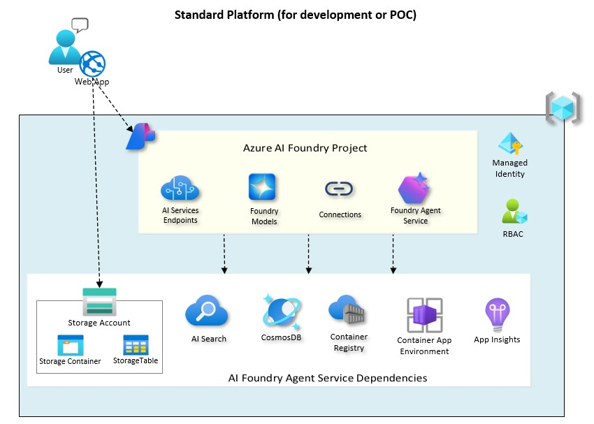

# Standard Infrastructure for the AI Agents

The intent of this page is to guide you through the deployment of a "Standard Infrastructure" where you will be able to implement and run our AI agents.

**This environment is ideal for development and proof-of-concept (POC) scenarios, with minimal security and cost controls for rapid iteration.**
For production deployments, please refer to this page [ai-landing-zone](./INFRA_AI_LZ.md).

This repo implements the **Standard Setup with Public Networking** described in this [article](https://learn.microsoft.com/en-us/azure/ai-foundry/agents/environment-setup#compare-setup-options).

The architecture for this setup is outlined below:



For more details on the standard agent setup, see the [standard agent setup concept page.](https://learn.microsoft.com/en-us/azure/ai-services/agents/concepts/standard-agent-setup)

The reason we are implementing this architecture and not the even simpler one called the [Basic Azure Foundry Chat Reference Architecture](https://learn.microsoft.com/en-us/azure/architecture/ai-ml/architecture/basic-azure-ai-foundry-chat) where the dependent resources shown above are managed by Microsoft, is because we need to bring our own Azure resources so that we have full control over our files, threads, and vector store.

This standard environment can be deployed through bicep or terraform as described in the following sections.

## Deployment guide

In the steps below, Azure resources for storing customer data, such as Azure Storage, Azure Cosmos DB, and Azure AI Search are automatically created if existing resources aren't provided.

For more information on the setup process, [see the getting started documentation.](https://learn.microsoft.com/en-us/azure/ai-services/agents/environment-setup)


### Prerequisites

- An [Azure subscription](https://azure.microsoft.com/free/)

  - The subscription must have all of the resource providers used in this deployment [registered](https://learn.microsoft.com/azure/azure-resource-manager/management/resource-providers-and-types#register-resource-provider).

    - `Microsoft.CognitiveServices`
    - `Microsoft.Insights`
    - `Microsoft.ManagedIdentity`
    - `Microsoft.OperationalInsights`
    - `Microsoft.Storage`

  - The subscription must have the following quota available in the region you choose.
    - OpenAI model: GPT-4.1 model deployment with 500k tokens per minute (TPM) capacity. Check the different AI model availability per region [here](https://learn.microsoft.com/en-us/azure/ai-foundry/foundry-models/concepts/models-sold-directly-by-azure?pivots=azure-openai&tabs=global-standard%2Cstandard-chat-completions#global-standard-model-availability)

- Your deployment user must have the following permissions at the Resource Group scope.

  - Ability to assign [Azure roles](https://learn.microsoft.com/azure/role-based-access-control/built-in-roles) on newly created resources (e.g. `Role Based Access Administrator` or `User Access Administrator` or `Owner`).
  - Ability to create Azure resources and purge deleted resources (e.g. `Contributor`).

### Bicep Deployment of the Standard Infrastructure for the AI Agents

For this deployment, we leverage the official Microsoft [Standard Agent Setup with Public Networking](https://github.com/microsoft-foundry/foundry-samples/tree/main/infrastructure/infrastructure-setup-bicep/41-standard-agent-setup) repo. 

After the automated deployment of the Reference Implementation, there are a few modifications to make to the environment for our Agents to work. These changes are detailed below.


#### Deployment through the Azure Portal

Click on the button below and follow the wizard to deploy the Foundry Standard setup to Azure:

[](https://portal.azure.com/#create/Microsoft.Template/uri/https%3A%2F%2Fraw.githubusercontent.com%2Fazure-ai-foundry%2Ffoundry-samples%2Frefs%2Fheads%2Fmain%2Finfrastructure%2Finfrastructure-setup-bicep%2F41-standard-agent-setup%2Fazuredeploy.json)

#### Deployment from the command line

Follow the steps below to deploy the Foundry Standard setup from the command line using the IaC code in this repo:

1. In your shell, clone this repo and navigate to the root directory of this repository.

   ```bash
	git clone https://github.com/microsoft-foundry/foundry-samples.git
	cd foundry-samples/infrastructure/infrastructure-setup-bicep/41-standard-agent-setup/
   ```

2. Log in and set your target subscription.

   ```bash
   az login
   az account set --subscription <your Azure subscription>
   ```

3. Set the deployment location to one with available quota in your subscription.

   ```bash
   LOCATION=eastus2
   ```

4. Create new (or use existing) resource group:

```bash
	az group create --name <resource-group-name> --location $LOCATION
```

5. Deploy the template

```bash
  	az deployment group create --debug \
       --resource-group <resource-group-name> \
       --template-file main.bicep \
  	   --parameters location=$LOCATION
```


### Terraform Deployment of the Standard Infrastructure for the AI Agents

The terraform code in this repo calls the [Azure Verified Module](https://aka.ms/AVM) (AVM) pattern module for the Foundry to deploy all the resources needed: https://registry.terraform.io/modules/Azure/avm-ptn-aiml-ai-foundry/azurerm/latest

After the automated deployment of the Reference Implementation, there are few modifications to make to the environment for our Agents to work. These changes are detailed below.
  

First make sure you have the following files in this folder:
- **variables.tf** → Defines what can be customized
- **terraform.tfvars** → Sets actual values for those variables
- **main.tf** → Uses those values to create infrastructure
- **outputs.tf** → Shows you important info about what was created

Make sure you have created a Service Principal for terraform and assigned it the role "Contributor" and "User Access Administrator" at your Resource Group level.
Then set the information about this Service Principal and your subscription in the following environment variables:
- ARM_CLIENT_ID
- ARM_CLIENT_SECRET
- ARM_SUBSCRIPTION_ID
- ARM_TENANT_ID

Then run the following commands:

```bash
# Initialize Terraform
terraform init

# Plan the deployment
terraform plan -var-file="terraform.tfvars"

# Apply the configuration
terraform apply -var-file="terraform.tfvars" -auto-approve
```


## Customize the deployed AI platform

Once you have the platform deployed, follow the steps below to make the changes required to enable our AI agents to work.

1.  Deploy an Embedding Model in Azure Foundry so that Azure AI Search can index the files it reads from the Azure Blob Storage, which is the knowledge store for the agents:

    - Go to your Azure Foundry project in the Azure Portal
    - Open the Model Catalog
    - Filter by "Embedding".
    - Choose the model: "text-embedding-3-large" (OpenAI)
    - Click "Use this model" → "Deploy".

2.  Assign the System Assigned Managed Identity of the AI Search service the roles:

    - "Storage Blob Data Reader" on the Azure Storage Account.
    - "Cognitive Services OpenAI Contributor" on the Azure Foundry service.
    - "Cognitive Services Contributor" on the Azure Foundry service.

3.  Assign the System Assigned Managed Identity of the Foundry **Project** the roles:

   - "Search Index Data Reader" on the Azure AI Search service mentioned above.
   - "Search Service Contributor" on the Azure AI Search service mentioned above.

4.  Create an App Insights instance.

5.  Add a connection to the App Insights that you created previously from the Foundry portal. Make sure you add it at the Project level.

6.  Assign yourself the following roles:

   - "Search Index Data Reader" in the AI Search service mentioned above, so that you can use the index explorer to query the indexed data.
   - "Storage Blob Data Contributor" in the Storage Account mentioned above, so that you can create containers and upload some sample application documents.
   - "Storage Table Data Contributor" in the same Storage Account so that you can view and update the tables created by the agent.


## Deploy the application for the AI Agents

For the steps to deploy the application components, refer to [DEPLOYMENT.md](./DEPLOYMENT.md).


## :broom: Clean up resources

Most Azure resources deployed in the prior steps will incur ongoing charges unless removed. Additionally, a few of the resources deployed go into a soft delete status which will restrict the ability to redeploy another resource with the same name and might not release quota. It's best to purge any soft deleted resources once you are done exploring. Use the following commands to delete the deployed resources and resource group and to purge each of the resources with soft delete.

> **Note:** This will completely delete any data you may have included in this example and it will be unrecoverable.

```bash
# These deletes and purges take about 30 minutes to run.
az group delete -n <resource-group-name> -y

# Purge the soft delete resources
az cognitiveservices account purge -g <resource-group-name>-l $LOCATION -n <ai-foundry-name>
```
