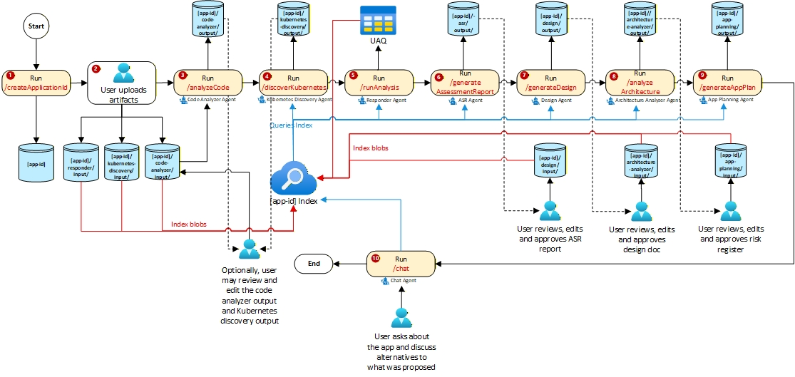

# End-to-End (E2E) Agent Workflow Tests

This folder contains end-to-end tests that validate the complete agent workflow by executing all agents in sequence and verifying their outputs.

## 📋 Table of Contents

- [Overview](#overview)
- [Test Files](#test-files)
- [Workflow Steps](#workflow-steps)
- [Prerequisites](#prerequisites)
- [Configuration](#configuration)
- [Running the Tests](#running-the-tests)
- [Test Reports](#test-reports)
- [Folder Structure](#folder-structure)
- [Blob Storage Structure](#blob-storage-structure)
- [Troubleshooting](#troubleshooting)
- [Related Tests](#related-tests)
- [Contributing](#contributing)

---

## Overview

The E2E tests simulate a real migration assessment workflow by:
1. Creating an application container in Azure Blob Storage
2. Uploading sample artifacts
3. Running each agent in the correct sequence
4. Copying outputs between agent folders as required
5. Validating successful completion of each step

The following diagram depicts the entire end-to-end workflow that these tests are implementing:



## Test Files

### test_prerequisites.py (Run First)

Before running the main workflow tests, run the prerequisites test to verify your Azure infrastructure is properly configured:

```bash
pytest tests/e2e/test_prerequisites.py -v
```

This test validates:

| Step | Check | Description |
|------|-------|-------------|
| 1 | Container Exists | Verifies the application container exists in Azure Blob Storage |
| 2 | Template Tables | Checks all 6 required template tables exist in Table Storage |
| 3 | Template Files | Validates required prompt/config files exist in `templates` container |
| 4 | Central Files | Confirms required files exist in `central` container |

**Required Template Tables:**
- `AppDetailsTemplate`
- `IntegrationDependencyTemplate`
- `MsSqlDBTemplate`
- `OracleDBTemplate`
- `InfrastructureDetails`
- `K8Stemplate`

**Required Template Files (in `templates` container):**
- `asr_prompt.json`
- `design_prompt.json`
- `kubernetes_discovery_prompts.json`
- `migration-matrix.json`

**Required Central Files (in `central` container):**
- `scf-controls.zip`

If prerequisites fail, follow the error messages to:
- Create the application container via `POST /createApplicationId`
- Run `python scripts/environment-setup/import_migration_agent_tables.py` to create tables
- Upload the required template files to the `templates` container
- Upload the required central files to the `central` container

### test_agent_workflow.py (Main Workflow)

The main E2E workflow test that executes all 11 steps in sequence.

## Workflow Steps

The test executes the following 11-step workflow:

| Step | Action | Endpoint/Operation | Description |
|------|--------|-------------------|-------------|
| 1 | Initialize App | `POST /createApplicationId` | Creates storage container, tables, and folder structure |
| 2 | Upload Artifacts | Blob Upload | Uploads sample artifacts to agent input folders |
| 3 | Code Analyzer | `POST /analyzeCode` | Analyzes source code for migration assessment |
| 4 | K8s Discovery | `POST /discoverKubernetes` | Discovers Kubernetes deployment configuration |
| 5 | Copy Outputs | Blob Copy | Copies code-analyzer & k8s-discovery outputs to responder input |
| 6 | Responder Agent | `POST /runAnalysis` | Populates template tables with extracted information |
| 7 | ASR Agent | `POST /generateAssessmentReport` | Generates Migration Assessment Report |
| 8 | Copy Outputs | Blob Copy | Copies ASR output to design input |
| 9 | Design Agent | `POST /generateDesign` | Generates Azure migration design document |
| 10 | Copy Outputs | Blob Copy | Copies design output to architecture-analyzer input |
| 11 | Architecture Analyzer | `POST /analyzeArchitecture` | Analyzes architecture for cloud migration readiness |

## Prerequisites

1. **Python 3.10+** with the following packages:
   ```bash
   pip install pytest pytest-asyncio pytest-order httpx azure-storage-blob azure-identity
   ```

2. **Azure CLI** logged in with appropriate permissions:
   ```bash
   az login
   ```

3. **Azure Resources**:
   - Azure Storage Account with blob and table storage enabled
   - Proper RBAC permissions (Storage Blob Data Contributor, Storage Table Data Contributor)

4. **API Server** running locally or accessible remotely:
   ```bash
   cd foundry-agents/agents
   uvicorn api_main:app --host 0.0.0.0 --port 8000
   ```

## Configuration

### Environment Variables

Create a `.env.test` file in the `foundry-agents/` directory:

```env
# API Configuration
API_BASE_URL=http://localhost:8000

# Azure Storage Configuration
AZURE_STORAGE_ACCOUNT_NAME=your_storage_account_name

# Test Configuration
TEST_APP_ID=E2ETEST001
TEST_USER_OBJECT_ID=your-user-object-id
AZURE_REGION=eastus2

# Optional: Resource Group (if using RBAC setup)
RESOURCE_GROUP=your-resource-group

# Evaluation Thresholds
CONFIDENCE_THRESHOLD=0.7
RELEVANCE_THRESHOLD=4.0
GROUNDEDNESS_THRESHOLD=4.0

# Timeouts
TEST_TIMEOUT_SECONDS=300
```

### Sample Artifacts

Place your test artifacts in the following folder structure:

```
tests/e2e/sample-artifacts/
│
├── code-analyzer/          # Source code files for code analysis
│   ├── terraform-azurerm-avm-test-main.zip
│   └── java-contoso-real-estate.zip
│
├── kubernetes-discovery/   # K8s manifests for discovery
│   └── kubernetes.zip
│
└── responder/              # Additional input documents
    ├── architecture.docx
    ├── communication_matrix.xlsx
    ├── server_config.pdf
    └── dependencies.json
```

## Running the Tests

### Recommended Order

1. **First, validate prerequisites:**
   ```bash
   pytest tests/e2e/test_prerequisites.py -v
   ```

2. **Then, run the full workflow (RECOMMENDED - with auto-stop on failure):**
   ```bash
   pytest tests/e2e/test_agent_workflow.py -v --order-scope=class -x
   ```

### Important Command-Line Parameters

**Required Parameters:**

- `--order-scope=class` - **REQUIRED**: Ensures tests run in sequential order (Steps 1-11). Without this flag, pytest runs tests in random order, causing failures since each step depends on previous steps.

**Recommended Parameters:**

- `-x` or `--exitfirst` - **STRONGLY RECOMMENDED**: Stops execution on first test failure. Essential for E2E workflows where each step depends on previous steps. Without this flag, pytest continues running remaining tests even after failures, causing cascading failures and wasting time.

- `-v` - Verbose output showing each test step

- `-s` - Show print statements and detailed logging (useful for debugging)

### Run All E2E Tests Together

```bash
# From the foundry-agents directory
cd foundry-agents

# RECOMMENDED: Run with auto-stop on failure
pytest tests/e2e/test_agent_workflow.py -v --order-scope=class -x

# Run with detailed logging (for debugging)
pytest tests/e2e/test_agent_workflow.py -v -s --order-scope=class -x

# Continue on failure (NOT recommended for E2E workflows)
pytest tests/e2e/test_agent_workflow.py -v --order-scope=class
```

### Run Specific Steps

Use the `-k` parameter to filter tests by name:

```bash
# Run only Step 1 (Create Application ID)
pytest tests/e2e/test_agent_workflow.py -v --order-scope=class -x -k "step1"

# Run Steps 1-3 only
pytest tests/e2e/test_agent_workflow.py -v --order-scope=class -x -k "step1 or step2 or step3"

# Skip Step 3 (run all others)
pytest tests/e2e/test_agent_workflow.py -v --order-scope=class -x -k "not step3"

# Skip Steps 1 and 2 (useful if container already created and artifacts uploaded)
pytest tests/e2e/test_agent_workflow.py -v --order-scope=class -x -k "not (step1 or step2)"

# Skip Steps 3 and 4
pytest tests/e2e/test_agent_workflow.py -v --order-scope=class -x -k "not (step3 or step4)"
```

### Run with Custom Configuration

```bash
# Use a specific app ID
TEST_APP_ID=MYAPP001 pytest tests/e2e/test_agent_workflow.py -v --order-scope=class -x

# Use a different API endpoint
API_BASE_URL=https://my-api.azurewebsites.net pytest tests/e2e/test_agent_workflow.py -v --order-scope=class -x
```

### Direct Python Execution

The script can be run directly with Python (includes `-x` flag by default):

```bash
python tests/e2e/test_agent_workflow.py
```

## Test Reports

After execution, test reports are saved to:

```
tests/e2e/reports/e2e_report_{app_id}_{timestamp}.json
```

The report includes:
- Application ID
- Steps completed
- Evaluation scores
- Errors (if any)
- Overall success status

## Folder Structure

```
tests/e2e/
├── README.md                  # This file
├── conftest.py               # E2E-specific pytest fixtures
├── test_prerequisites.py     # Infrastructure validation (run first)
├── test_agent_workflow.py    # Main E2E workflow test (run second)
├── reports/                  # Generated test reports
│   └── e2e_report_*.json
└── sample-artifacts/         # Test input files
    ├── code-analyzer/
    ├── kubernetes-discovery/
    └── responder/
```

## Blob Storage Structure

The tests create the following structure in Azure Blob Storage:

```
{app-id}/                              # Container name = app_id
├── code-analyzer/
│   ├── input/                         # Uploaded from sample-artifacts/code-analyzer/
│   └── output/                        # Generated by Code Analyzer Agent
├── kubernetes-discovery/
│   ├── input/                         # Uploaded from sample-artifacts/kubernetes-discovery/
│   └── output/                        # Generated by K8s Discovery Agent
├── responder/
│   ├── input/                         # Uploaded + copied outputs from other agents
│   └── output/                        # Generated by Responder Agent
├── asr/
│   ├── input/
│   └── output/                        # Generated by ASR Agent
├── design/
│   ├── input/                         # Copied from asr/output/
│   └── output/                        # Generated by Design Agent
└── architecture-analyzer/
    ├── input/                         # Copied from design/output/
    └── output/                        # Generated by Architecture Analyzer Agent
```

## Troubleshooting

### Common Issues

1. **API Connection Failed**
   ```
   Cannot connect to API at http://localhost:8000
   ```
   **Solution**: Ensure the API server is running:
   ```bash
   uvicorn api_main:app --host 0.0.0.0 --port 8000
   ```

2. **Azure Authentication Failed**
   ```
   DefaultAzureCredential failed to retrieve a token
   ```
   **Solution**: Run `az login` and ensure your account has proper permissions.

3. **No Artifacts Uploaded**
   ```
   No artifacts were uploaded. Ensure sample-artifacts folders exist
   ```
   **Solution**: Add test files to `tests/e2e/sample-artifacts/` subfolders.

4. **Blob Copy Failed**
   ```
   Copy operation failed with 403 Forbidden
   ```
   **Solution**: Ensure your Azure identity has `Storage Blob Data Contributor` role.

5. **Test Timeout**
   ```
   Operation timed out after 1800 seconds
   ```
   **Solution**: Some agents take longer on first run. Increase `TEST_TIMEOUT_SECONDS`.

### Debug Mode

Enable detailed logging:

```bash
# Set log level to DEBUG
pytest tests/e2e/test_agent_workflow.py -v -s --log-cli-level=DEBUG
```

### Check Test Environment

Run prerequisite tests to validate your environment:

```bash
pytest tests/e2e/test_prerequisites.py -v
```

## Related Tests

- **Integration Tests**: `tests/integration/` - Test individual API endpoints
- **Unit Tests**: `tests/unit/` - Test agent components in isolation
- **Evaluation Tests**: `tests/evaluation/` - Test response quality metrics

## Contributing

When adding new workflow steps:

1. Add the test method with `@pytest.mark.order(N)` decorator
2. Update the workflow documentation in this README
3. Add any new sample artifacts to `sample-artifacts/`
4. Update the workflow summary test to include the new step
